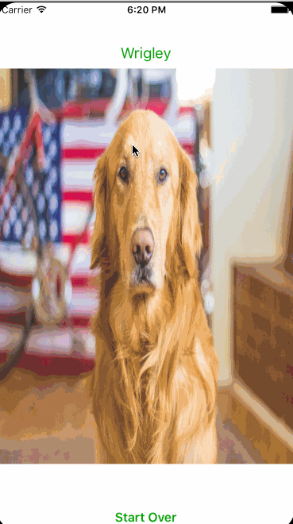
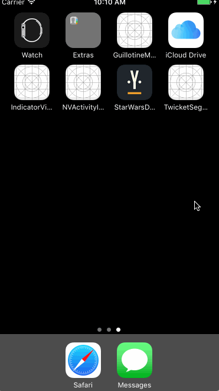

# iOS Demo

学习的Demo合集。基本上用Swift实现

## Demo的效果图汇总

### DropDownNotification

### 自定义的ViewController Transition

### Indicator View

学习了[NVAcitivityIndicatorView](https://github.com/ninjaprox/NVActivityIndicatorView)的实现，它的代码结构设计个人感觉很棒

